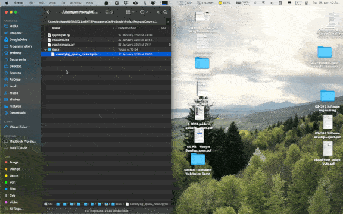

# ipynb2pdf.py
Python program that automatically converts a ".ipynb" Jupyter Notebook file into
a readable ".pdf" document.

## Table of contents
* [1. Description](#1-description)
* [2. Getting started](#2-getting-started)
    * [2.1 Dependencies](#21-dependencies)
    * [2.2 Installing](#22-installing)
    * [2.3 Executing program](#23-executing-program)
* [3. Version history](#3-version-history)

<!-- toc -->

## 1. Description
`ipynb2pdf.py` is a Python program that makes use of the `nbconvert`
(cf.: https://github.com/jupyter/nbconvert) and `wkhtmltopdf` (cf.:
https://wkhtmltopdf.org) commands to convert a ".ipynb" file into a ".pdf" file.

## 2. Getting started

### 2.1 Dependencies
* Tested on macOS Big Sur version 11.0.1
* Python 2.7

### 2.2 Installing
`pip install -r requirements.txt`

### 2.3 Executing program
- To access useful help messages, type following Terminal command at the root of
  the project:
  
  `/usr/local/bin/python2.7 ipynb2pdf.py -h`

- To convert a single ".ipynb" Jupyter Notebook file into a readable ".pdf"
  document using the ".ipynb" absolute file path saved in the clipboard, type
  following Terminal command at the root of the project:
  
  `/usr/local/bin/python2.7 ipynb2pdf.py`

  The program will automatically get the clipboard stored ".ipynb" absolute file
  path and generate the corresponding ".pdf" file version.
  

- To convert a single ".ipynb" Jupyter Notebook file into a readable ".pdf"
  document using the ".ipynb" absolute file path provided as a command line
  argument, type following Terminal command at the root of the project:
  
  `/usr/local/bin/python2.7 ipynb2pdf.py --path /path/to/ipynb/file`

  The program will automatically use ".ipynb" absolute file path and generate
  the corresponding ".pdf" file version.

 
Remark: with a Bash Terminal window, `/usr/local/bin/python2.7` can simply be
replaced by `python`.

 
## 3. Version history
* 0.1
    * Initial release